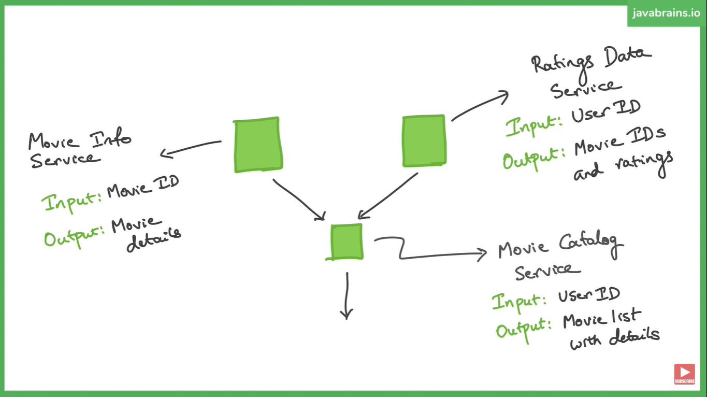
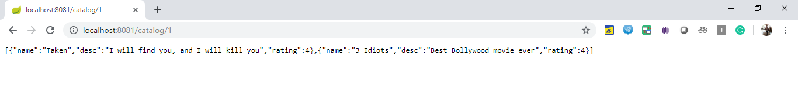
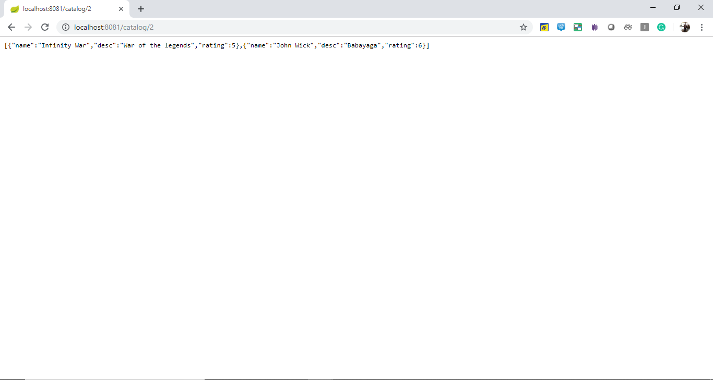

# Building-Microservices-with-Gradle

* I created 3 microservices that interact with each other in Spring Boot using Gradle in Java 8.

* This application doesn't have a proper UI and focuses on the Backend and the Database part.

## Getting Started

#### 1. Microservice architecture with Hardcoded Data

* Create 3 different project using [Spring Initializr](https://start.spring.io/).
* Create resources and model classes for all of them.
* Building movie catalog service API, movie info service API and rating data service API.
* Creating replicas in the movie catalog service for the classes used in the services other two services.
* Have movie catalog service API call the other two services.
* The code will be in the `master` branch.

#### 2. Microservice architecture with an embedded Database

* The services created in the previous step will be used to create an architecture with an embedded DB.The hardcoded data will be removed from the app.
* The code will be in the `mongo` branch.

#### 3. Microservice architecture with an embedded Database and eureka as service discovery (Yet to be implemented)

* The code will be in the `eureka` branch.
* New spring boot application called `disovery-server` is created whioh acts as the Eureka Server. All services are registered here.
* New Dependencies are added in the other 3 services to act as Eureka Clients and are assigned name in the `application.properties` files.
* Hardcoded URL's are updated with the service names. 
* The registered services can be seen below:
    

* The output still remains the same:
	Catalog-1
    
	Catalog-2
    

#### 4. Dockerized Microservice architecture with an embedded Database and eureka as service discovery (Yet to be implemented)

* The code will be in the `docker` branch.

## Tools Required

* Spring Boot
* Gradle
* IDE (Intellij)
* Java 8
* MongoDB

## Resources

* [Java Brains Tutorial](https://www.youtube.com/playlist?list=PLqq-6Pq4lTTZSKAFG6aCDVDP86Qx4lNas)